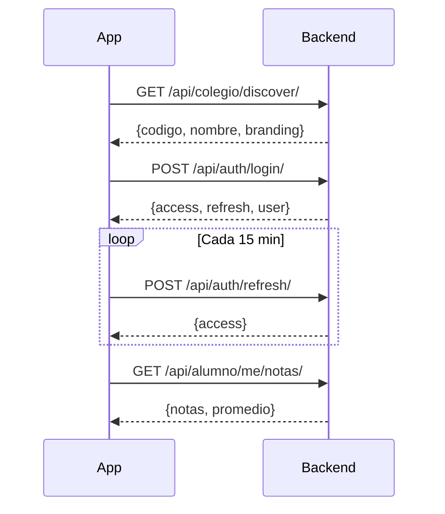

# Schoolar OS - Documentación Técnica

> **Sistema de Gestión Escolar - Backend Django**

---

## 🏗️ Arquitectura del Sistema

### Modelo "Skeleton & Fleet"
```
┌─────────────────────────────────────────────────────────────┐
│                    DIRECTORIO CENTRAL                       │
│                 (Microservicio de Discovery)                │
│                    schoolar.cl/directory                    │
└──────────────────────────┬──────────────────────────────────┘
                           │
        ┌──────────────────┼──────────────────┐
        ▼                  ▼                  ▼
┌───────────────┐  ┌───────────────┐  ┌───────────────┐
│   VPS Colegio │  │   VPS Colegio │  │   VPS Colegio │
│      "A"      │  │      "B"      │  │      "C"      │
│ COLE-A1B2     │  │ COLE-X9Y8     │  │ COLE-W1D9     │
├───────────────┤  ├───────────────┤  ├───────────────┤
│    Docker     │  │    Docker     │  │    Docker     │
│  ┌─────────┐  │  │  ┌─────────┐  │  │  ┌─────────┐  │
│  │ Django  │  │  │  │ Django  │  │  │  │ Django  │  │
│  │ Gunicorn│  │  │  │ Gunicorn│  │  │  │ Gunicorn│  │
│  └────┬────┘  │  │  └────┬────┘  │  │  └────┬────┘  │
│       │       │  │       │       │  │       │       │
│  ┌────┴────┐  │  │  ┌────┴────┐  │  │  ┌────┴────┐  │
│  │PostgreSQL│ │  │  │PostgreSQL│ │  │  │PostgreSQL│ │
│  └─────────┘  │  │  └─────────┘  │  │  └─────────┘  │
└───────────────┘  └───────────────┘  └───────────────┘
```

**Características:**
- 1 contenedor Docker = 1 colegio
- Aislamiento físico de datos
- Cada colegio tiene su propia base de datos PostgreSQL

---

## 📁 Estructura del Proyecto

```
Proyecto Integrado pagina web/
├── apps/
│   ├── academico/       # Calificaciones, asistencia, horarios
│   ├── api/             # API REST para App móvil
│   ├── calendario/      # Eventos del calendario escolar
│   ├── comunicacion/    # Noticias y comunicados
│   ├── core/            # Configuración, notificaciones, utils
│   ├── documentos/      # Intranet y archivos
│   ├── mensajeria/      # Sistema de mensajes internos
│   ├── tareas/          # Tareas y entregas
│   └── usuarios/        # Perfiles y autenticación
├── config/
│   ├── settings.py      # Configuración Django
│   ├── urls.py          # Rutas principales
│   └── wsgi.py          # WSGI para producción
├── docker/
│   ├── entrypoint.sh    # Script de inicialización
│   ├── nginx.conf       # Configuración Nginx
│   └── env.example      # Variables de entorno
├── docs/
│   └── api_spec.md      # Documentación de la API
├── static/              # CSS, JS, imágenes
├── templates/           # Templates HTML
├── Dockerfile           # Dockerfile desarrollo
├── Dockerfile.prod      # Dockerfile producción
└── docker-compose.prod.yml
```

---

## 🗄️ Modelos de Datos

### App: usuarios
| Modelo | Descripción |
|--------|-------------|
| `PerfilUsuario` | Extensión de User con RUT, tipo, foto |
| `Pupilo` | Relación apoderado ↔ estudiante |

### App: academico
| Modelo | Descripción |
|--------|-------------|
| `Asignatura` | Materias (MAT, LEN, HIS...) |
| `Curso` | 1° Medio A, 2° Medio B... |
| `InscripcionCurso` | Alumno inscrito en curso |
| `Calificacion` | Notas 1.0-7.0 |
| `Asistencia` | Presente/Ausente/Tardanza |
| `HorarioClases` | Horario semanal |
| `Anotacion` | Hoja de vida (+/-) |

### App: tareas
| Modelo | Descripción |
|--------|-------------|
| `Tarea` | Tarea asignada por profesor |
| `Entrega` | Entrega del estudiante |

### App: core
| Modelo | Descripción |
|--------|-------------|
| `ConfiguracionAcademica` | Año y semestre actual (singleton) |
| `ColegioConfig` | Código único + branding (singleton) |
| `Notificacion` | Notificaciones web |

---

## 🔐 Roles de Usuario

| Rol | Código | Permisos |
|-----|--------|----------|
| Estudiante | `estudiante` | Ver notas, asistencia, tareas |
| Apoderado | `apoderado` | Ver datos de pupilos |
| Profesor | `profesor` | CRUD notas, tareas, asistencia |
| Administrativo | `administrativo` | Gestión de datos |
| Directivo | `directivo` | Acceso total |

---

## 🌐 API REST

### Autenticación: JWT (SimpleJWT)
- **Access Token:** 15 minutos
- **Refresh Token:** 7 días
- **Header:** `Authorization: Bearer <token>`

### Endpoints Disponibles

```
# Auth
POST /api/auth/login/              # Login → tokens + user
POST /api/auth/refresh/            # Renovar access token

# Alumno
GET  /api/alumno/me/               # Perfil + curso
GET  /api/alumno/me/notas/         # Notas + promedio
GET  /api/alumno/me/asistencia/    # Asistencia + %
GET  /api/alumno/me/horario/       # Horario semanal
GET  /api/alumno/me/anotaciones/   # Hoja de vida
GET  /api/alumno/me/tareas/        # Tareas pendientes/entregadas
GET  /api/alumno/me/entregas/      # Entregas con calificación

# Apoderado
GET  /api/apoderado/pupilos/       # Hijos con resumen

# Notificaciones
GET  /api/notificaciones/          # Lista de notificaciones
POST /api/notificaciones/{uuid}/leer/  # Marcar leída

# Colegio (Phone Home)
GET  /api/colegio/discover/        # PÚBLICO - Info + branding
```

### Formato de Respuesta Estándar
```json
{
  "success": true,
  "data": { ... },
  "message": "OK",
  "errors": null
}
```

---

## 🔧 Stack Tecnológico

### Backend
| Tecnología | Versión | Uso |
|------------|---------|-----|
| Django | 5.0+ | Framework web |
| Django REST Framework | 3.16+ | API REST |
| SimpleJWT | 5.5+ | Autenticación JWT |
| PostgreSQL | 15 | Base de datos (prod) |
| SQLite | - | Base de datos (dev) |
| Gunicorn | - | WSGI Server |
| WhiteNoise | - | Archivos estáticos |

### Frontend Web
| Tecnología | Uso |
|------------|-----|
| Django Templates | SSR |
| HTMX | Interactividad |
| Bootstrap 5 | CSS Framework |
| Crispy Forms | Formularios |
| Jazzmin | Admin theme |

### DevOps
| Tecnología | Uso |
|------------|-----|
| Docker | Containerización |
| Nginx | Reverse proxy |
| Docker Compose | Orquestación |

---

## 🚀 Despliegue

### Desarrollo
```bash
python manage.py runserver
```

### Producción
```bash
# 1. Configurar variables
cp docker/env.example .env.prod
nano .env.prod

# 2. Construir y levantar
docker-compose -f docker-compose.prod.yml up --build -d

# 3. Ver logs
docker-compose -f docker-compose.prod.yml logs -f web
```

### Variables de Entorno Requeridas
```env
SECRET_KEY=...
DEBUG=False
ALLOWED_HOSTS=dominio.cl
POSTGRES_DB=schoolar_db
POSTGRES_USER=schoolar_user
POSTGRES_PASSWORD=...
COLEGIO_NOMBRE=Mi Colegio
COLEGIO_URL=https://mi-colegio.cl
```

---

## 🔒 Seguridad

| Medida | Implementación |
|--------|----------------|
| UUID públicos | Nunca exponer IDs enteros |
| JWT | Access 15min, Refresh 7d |
| CORS | Configurado para App |
| Rate Limiting | Nginx: 5/s login, 30/s API |
| CSRF | Tokens en formularios web |
| Usuario non-root | Dockerfile.prod |
| Security Headers | Nginx (X-Frame, XSS, etc.) |

---

## 📱 Flujo de la App Móvil



---

## 📋 Comandos Útiles

```bash
# Ver código del colegio
python manage.py generate_school_code

# Crear superusuario
python manage.py createsuperuser

# Ejecutar migraciones
python manage.py migrate

# Recolectar estáticos
python manage.py collectstatic

# Tests
python manage.py test

# Check de configuración
python manage.py check --deploy
```

---

## 📞 Contacto

**Proyecto:** Schoolar OS  
**Código Generado:** COLE-W1D9  
**Versión:** 1.0.0  
**Última actualización:** Diciembre 2024
